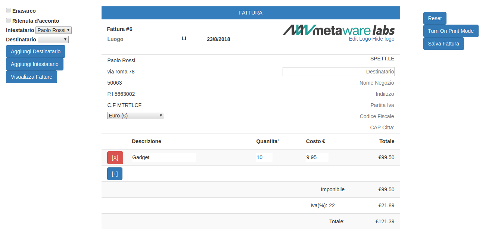
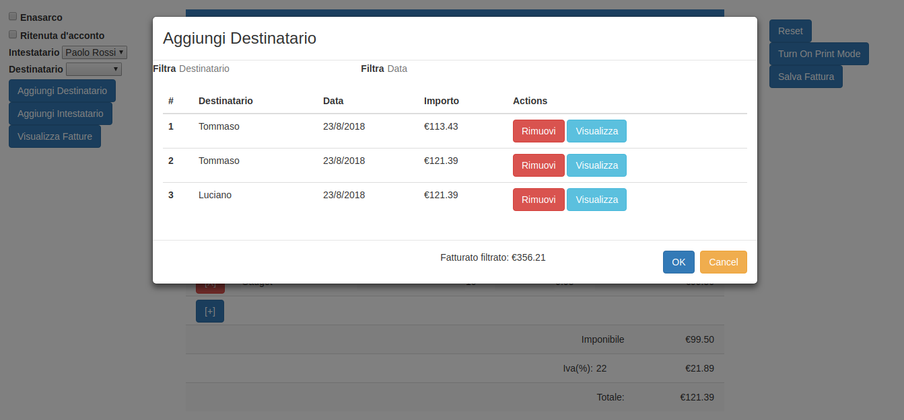

# Clothing Merchant Revenue Manager
Italian clothing merchant invoices manager built with **NodeJS** + **AngularJS** + **Bootstrap** + **Express**

## Requirements:
- install **npm** and **NodeJs** and install packages.json via: `npm install`
- copy [ui-bootstrap-tpls-2.5.0.min.js](https://angular-ui.github.io/bootstrap/) under **public/javascripts/**
- create a folder named **mydb** in which you install **Mongodb** client and start it with: 
`mongod --dbpath "./mydb"`
- go into the root and start **NodeJs** server with: `npm start`

## Previews:

## References:
-  The frontend is forked from the [angular-invoicing project](https://github.com/metaware/angular-invoicing)